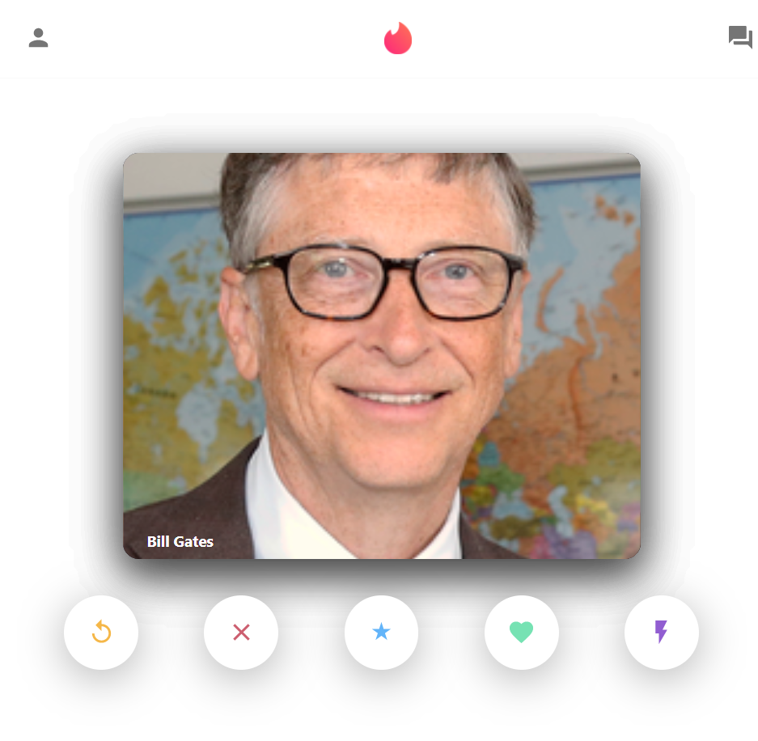

<h1 align="center">
  
   
  Tinder Clone Built Using MERN Stack.
</h1>

  This is a simple clone that I created for practicing my MERN Stack skills and improve myself.
     
  <strong><em>Here is the live version:</em></strong> https://tinder-clone-da32f.web.app/

  
# Home Page

